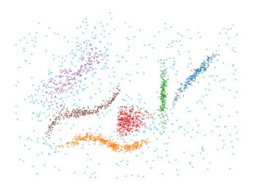
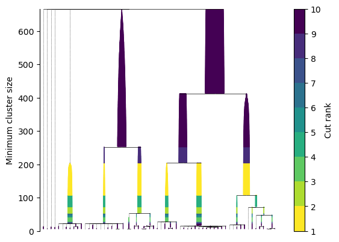
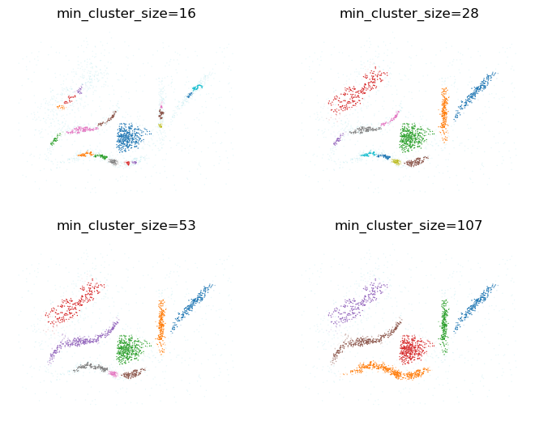

.. toctree::
   :caption: Features
   :maxdepth: 1
   :hidden:

   using_basic_api
   using_exploration_plots
   using_other_distances
   using_multiple_components
   using_sample_weights
   using_bi_persistences

.. toctree::
   :caption: Demonstrations
   :maxdepth: 1
   :hidden:

   demo_selection_strategies
   demo_parameter_sensitivity
   demo_computational_performance

.. toctree::
   :caption: API reference
   :maxdepth: 1
   :hidden:
   
   _autosummary/fast_plscan
   _autosummary/fast_plscan.plots
   _autosummary/fast_plscan._api
   _autosummary/fast_plscan._helpers

.. toctree::
   :caption: Development
   :maxdepth: 1
   :hidden:
   
   local_development

|PyPI version| |Conda version| |DOI badge|

Persistent Leaves Spatial Clustering of Applications with Noise
===============================================================

This library provides a new clustering algorithm based on HDBSCAN*. The primary
advantages of PLSCAN over the `hdbscan
<https://github.com/scikit-learn-contrib/hdbscan>`_ and `fast_hdbscan
<https://github.com/TutteInstitute/fast_hdbscan>`_ libraries are:

 - PLSCAN automatically finds the optimal minimum cluster size.
 - PLSCAN can easily use all available cores to speed up computation;
 - PLSCAN has much faster implementations of tree condensing and cluster extraction;
 - PLSCAN does not rely on JIT compilation.

To use PLSCAN, you only need to set the ``min_samples`` parameter. This
parameter controls how many neighbors are considered when measuring distances
between points. Setting a higher value for ``min_samples`` makes the algorithm
group points into larger, smoother clusters, and usually results in fewer, more
stable clusters.

.. code:: python

    import numpy as np
    import matplotlib.pyplot as plt

    from fast_plscan import PLSCAN

    data = np.load("docs/data/data.npy")

    clusterer = PLSCAN(
      min_samples = 5, # same as in HDBSCAN
    ).fit(data)

    plt.figure()
    plt.scatter(
      *data.T, c=clusterer.labels_ % 10, s=5, alpha=0.5, 
      edgecolor="none", cmap="tab10", vmin=0, vmax=9
    )
    plt.axis("off")
    plt.subplots_adjust(left=0, right=1, top=1, bottom=0)
    plt.show()

The algorithm creates a hierarchy of leaf-clusters by changing the minimum
cluster size. As this parameter varies, clusters appear or disappear. For each
minimum cluster size, the algorithm measures how long these leaf-clusters
persist. It then selects the minimum cluster size where the total persistence is
highest, giving the most stable clustering. You can visualize this hierarchy
using the ``leaf_tree_`` attribute, which provides an alternative to HDBSCAN*'s
condensed cluster tree.

.. code:: python

    clusterer.leaf_tree_.plot(leaf_separation=0.1)
    plt.show()

You can also explore how the clustering changes for other important values of
the minimum cluster size. The ``cluster_layers`` method automatically finds the
most persistent clusterings and returns their cluster labels and membership
strengths.

.. code:: python

    layers = clusterer.cluster_layers(max_peaks=4)
    for i, (size, labels, probs) in enumerate(layers):
        plt.subplot(2, 2, i + 1)
        plt.scatter(
            *data.T,
            c=labels % 10,
            alpha=np.maximum(0.1, probs),
            s=1,
            linewidth=0,
            cmap="tab10",
        )
        plt.title(f"min_cluster_size={int(size)}")
        plt.axis("off")
    plt.subplots_adjust(left=0, right=1, top=1, bottom=0)
    plt.show()

Citing
------

When using this work, please cite our (upcoming) preprint:

.. code-block:: bibtex

   @article{bot2025plscan,
      title         = {Persistent Multiscale Density-based Clustering},
      author        = {Dani{\"{e}}l M. Bot and Leland McInnes and Jan Aerts},
      year          = {2025},
      month         = {12},
      archiveprefix = {arXiv},
      eprint        = {TODO},
      primaryclass  = {cs.CL}
   }

Licensing
---------

The ``fast-plscan`` package has a 3-Clause BSD license.

.. |PyPI version| image:: https://badge.fury.io/py/fast-plscan.svg
   :target: https://badge.fury.io/py/fast-plscan
.. |Conda version| image:: https://anaconda.org/conda-forge/fast-plscan/badges/version.svg
   :target: https://anaconda.org/conda-forge/fast-plscan
.. |DOI badge| image:: https://zenodo.org/badge/1022168364.svg
  :target: https://doi.org/10.5281/zenodo.17964285 